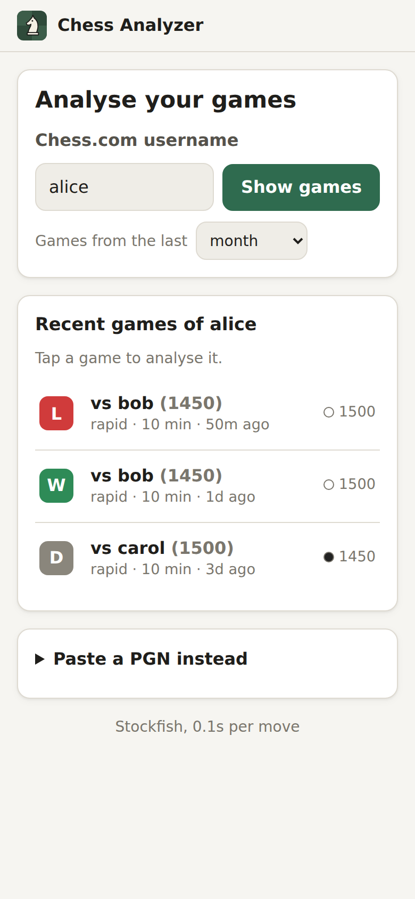
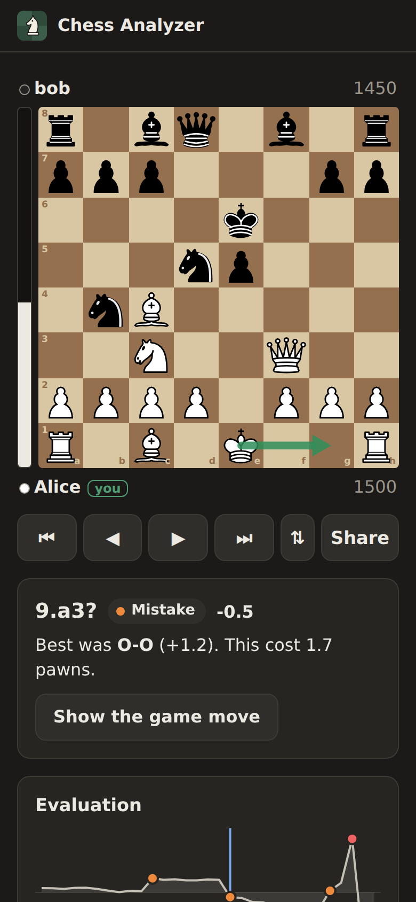

# Chess Game Analyzer

---
<p align="center">
  
  
  <a href="https://github.com/psf/black"></a>
</p>

## Introduction

Chess Game Analyzer downloads your recent games from Chess.com or Lichess, runs Stockfish over every move and checks the opening against established theory. Use it from your phone through the web app, or from the command line. For each game it reports:

- your average centipawn loss and a Chess.com-style review: how many of your moves were brilliant, great, best, good, inaccuracies, mistakes, misses or blunders;
- your biggest mistakes, with the evaluation before and after, the move Stockfish preferred and what kind of error it was (a hung piece, a missed tactic, a spoiled endgame, …);
- how you used your clock: mistakes played in under 3 seconds, mistakes made in time trouble and long thinks on obvious moves;
- the move where you or your opponent left opening theory, and the book moves that score best from that position;
- whether you carried out the typical pawn breaks of your opening (such as ...c5 and ...f6 in the French Defense), or missed them when the engine wanted them;
- the critical moments: the few positions where only one move kept the game balanced, and whether you found it;
- for every move, an explanation in plain English of why it is good or bad: what it does, how the opponent punishes it and what the better move would have achieved, instead of just an engine line.

Every position where you missed the best move becomes a puzzle you solve by moving the pieces, and a spaced-repetition trainer brings each one back until you find it every time.

Across several games it shows how your accuracy develops over time, where you leave book in each opening, how often you play its pawn breaks and how you score with and without them, in which phase of the game you lose the most, and which kinds of mistakes you make most often. It also compares you with other players at your rating, so you know which part of your game lags behind for your level.

## Table of Contents 🗂

- [How it works](#how-it-works)
- [Installation](#installation)
- [Usage](#usage)
- [Web app](#web-app)
- [Self-hosting on a Raspberry Pi](#self-hosting-on-a-raspberry-pi)
- [Citation](#citation)
- [Contributing](#contributing)
- [License](#license)

## How it works 🔑

1. **Fetch the games.** Games come from the free [Chess.com Public API](https://www.chess.com/news/view/published-data-api) or the [Lichess API](https://lichess.org/api#tag/Games/operation/apiGamesUser), which need no authentication (`chess_analyzer.fetch`). Lichess games are converted to the shape of Chess.com's, so everything after this step treats them the same; Lichess's classical games count as rapid and its correspondence games as daily. Chess variants such as Chess960 are skipped.
2. **Parse the PGNs.** [`python-chess`](https://python-chess.readthedocs.io/) reads the PGN and replays the game (`chess_analyzer.parse`).
3. **Check the opening.** The game's first 15 moves are compared with a local [Polyglot](https://www.chessprogramming.org/PolyGlot) book (`.bin`) or the [Lichess Opening Explorer](https://lichess.org/api#tag/Opening-Explorer) (`chess_analyzer.openings`). The first move that is not in the book is reported, along with the book alternatives, ranked by how well they score for the side to move.
4. **Evaluate the moves, using the engine as little as possible** (`chess_analyzer.engine`). Each position is handled by the cheapest source that can answer it:
   - **Opening book:** moves before the deviation are theory. They are marked *Book* and are not evaluated. The deviating move itself is still judged by the engine.
   - **Endgame tablebases:** positions with 5 pieces or fewer are looked up in the [Syzygy](https://syzygy-tables.info/) tablebases. That gives the exact result (win, draw or loss) and the best move with no search. Stockfish also uses the tablebases inside its own search.
   - **Forced moves:** a position with only one legal move takes the evaluation of the position after it.
   - **Stockfish** searches everything else to depth 16 by default. It uses Stockfish 16 or later (the Docker image builds 17.1), which evaluates positions with its NNUE neural network.

   Each move's centipawn loss is the drop in evaluation for the side that moved. Evaluations are capped at ±10 pawns, so going from "mate in 5" to "+15" does not count as a blunder. A loss of 50 centipawns or more is an inaccuracy, 100 or more a mistake, and 300 or more a blunder. As on Chess.com, a mistake or blunder that only missed a mate or a winning tactic, leaving you no worse than half a pawn down, is a *miss*; the only move that kept the balance in a critical moment is *great*; and a best (or nearly best) move that gives up a piece without making your position worse, from a position that was not already easily won, is *brilliant*. Book and forced moves don't count towards the average centipawn loss.
5. **Explain the mistakes** (`chess_analyzer.insights`). Using the engine's best move and the opponent's best reply, each mistake and blunder gets a category. These are heuristics; they don't need any extra engine time:

   | Category | When |
   | --- | --- |
   | Allowed mate / Missed mate | The move allows a forced mate, or gives up one. |
   | Hung a piece | The opponent's best reply wins a piece for free or for a cheaper one. |
   | Unsound attack | A capture or check whose piece is then simply taken. |
   | Allowed a tactic | The opponent's best reply is a check or capture. |
   | Spoiled a won endgame | Winning (+3) before the move and no longer winning (below +1) after it, in an endgame. |
   | Missed tactic | The engine's move was a check or capture that you didn't play. |
   | Positional | None of the above. |

   Each move is also put in a phase: the endgame starts once at most six queens, rooks, bishops and knights are left, and the opening lasts until move 10 unless pieces are traded off earlier. From Chess.com's clock times (`[%clk]`), mistakes played in under 3 seconds are flagged as impulsive, those with less than 10% of the starting time left as made in time trouble, and long thinks (10% of the starting time, at most two minutes) on forced moves or plain recaptures as wasted time.
   Every move also gets an explanation in words (`chess_analyzer.explain`), so you learn *why* rather than just *what*. python-chess works out concrete facts about the move: what it captures and whether that wins material, checks, threats and forks, pins, piece development, control of the centre, castling and king safety, passed pawns, and the pieces it defends or leaves unprotected. For a mistake the same is done for the opponent's best reply, to show how it is punished, and for the engine's best move, with the material its line wins. The facts are put into sentences such as:

   > 3...Bc5 is a mistake: it turns a roughly equal position for Black into a clearly worse position. It develops the bishop. The problem is that White answers Ng5, which puts pressure on the pawn on f7. Better was Nf6, which puts pressure on the pawn on e4 and develops the knight.

   This needs no engine time and no model, so it runs anywhere, including on a Raspberry Pi. Optionally, a small language model rewords the explanation the way a coach would talk (see [A coach for the explanations](#a-coach-for-the-explanations)). It only gets the facts, never the board: language models are poor at chess but good at wording, so the facts stay the source of truth.
6. **Find the critical moments** (`chess_analyzer.engine`). Most moves are developing moves or recaptures; a game is usually decided in a few positions where only one move holds. A position is a critical moment when the best move keeps it roughly equal (within ±1 pawn) and the second-best move leaves the side to move at least 2 pawns behind. Plain recaptures don't count, and at most three critical moments are kept per side, those with the largest gap between the two moves. To find the second-best move, the engine searches the position again without its best move. That is only needed in roughly equal positions where the best move was played or the game move lost at least 2 pawns (otherwise the game move itself shows that a second move holds), which kept the extra engine time to about 25% on a test game; games with long stretches of engine-best moves outside the opening book cost more. `--no-critical` skips it.
7. **Turn your misses into puzzles** (`chess_analyzer.puzzles`). The position before each of your mistakes, misses and blunders, and each critical moment you got wrong, becomes a puzzle; moves you found are left out. The solution is the move you did not play, followed by the engine's line for as long as it stays forcing: it ends with your move, after at most three of them, at checkmate or at your last capture, check or promotion. Puzzles come back on a schedule, like Anki flashcards: one you solve comes back after 3 days, then after a week, two weeks, a month and so on; one you fail comes back the next day and starts over. At most 10 new puzzles a day are added to the reviews that are due.
8. **Look for patterns across games** (`chess_analyzer.stats`). Your average centipawn loss per game shows whether your play is getting more accurate. Openings are grouped by family (e.g. *Sicilian Defense*), with the move where you leave book on average: leaving it by move 6 means the opening is worth studying, while staying in book past move 12 means your time is better spent on the middlegame. Together with the loss per phase, the most common kind of mistake and your time management, this gives a short list of what to work on.
9. **Check the opening's plans** (`chess_analyzer.plans`). Below master level, opponents leave book long before a memorised line ends, so knowing the opening's structure matters more than its moves. For 18 common openings, each side has one or two typical pawn breaks (in the French Defense, Black's ...c5 and ...f6; in the King's Indian, Black's ...e5 and ...f5). In the first 25 moves, each break is *played* (a pawn pushed up its file to that square), *unsound* (played, but a mistake or blunder), *missed* (the engine's best move at some point, but never played) or did not come up. Across games, the opening stats show how often you played each break, how often you missed it, and your score with and without it. This needs no extra engine time, and the opening stats include games analysed before this check existed.
10. **Compare with your peers** (`chess_analyzer.peers`). Your endgame loss means little on its own: it matters whether players at your rating do better. This works for Chess.com players only for now. Chess.com pairs players of the same rating, so the search starts from your recent opponents and walks from player to player, always visiting the one closest to your rating next. It keeps up to 100 rated games of your usual time control in which a player is rated within 100 points of you (at most 8 per player's archive, so a few players who play a lot don't make up the sample). That takes about 25 requests to the Chess.com API and no engine time. Your numbers and theirs are put side by side:
    - **Clock**, for every game, straight from Chess.com's clock times: seconds per move, the share of games in which a player fell below 10% of the starting clock, and the share lost on time. Chess.com's own accuracy is compared for the games someone ran a Game Review on.
    - **Accuracy and tactics**, once the peer games are analysed like your own: centipawn loss per phase, blunders, missed tactics and tactics allowed per 100 moves, and the share of critical moments found. Analysing 100 games is too much work for a Raspberry Pi or a phone, so they are analysed 10 at a time, and the comparison sharpens with each batch.

    A difference counts when the samples are large enough (30 of your moves and 100 of theirs, or 5 and 10 games) and it is at least 20% and 5 centipawns (or 10 percentage points for shares). The weakest phase compared with your peers is named first; when another phase is already better than theirs, studying it gains you less right now. You can also compare yourself with players 200 points above you, to see what separates you from the next level.

## Installation ⚙️

You need Python 3.10 or later and a [Stockfish](https://stockfishchess.org/download/) binary.

```bash
pip install -r requirements.txt
```

or

```bash
pip install git+https://github.com/StephanAkkerman/chess-game-analyzer.git
```

Stockfish is found automatically if `stockfish` is on your `PATH` (for example after `apt install stockfish` or `brew install stockfish`). Otherwise, pass `--engine /path/to/stockfish` or set `STOCKFISH_PATH`.

## Usage ⌨️

Analyse your five most recent games from this month:

```bash
python -m chess_analyzer YOUR_USERNAME
```

When the package is installed with pip, the `chess-analyzer` command does the same. From a clone without installing, run it with `PYTHONPATH=src`.

Some useful options:

| Option | Description |
| --- | --- |
| `--site lichess` | Download the games from Lichess instead of Chess.com (`chess.com`, the default, or `lichess`). |
| `--months N` | Search games from the last N calendar months (default 1). |
| `--max-games N` | Analyse at most N games (default 5). |
| `--time-class blitz` | Only analyse `bullet`, `blitz`, `rapid` or `daily` games. |
| `--pgn FILE` | Analyse games from a local PGN file instead of downloading them. |
| `--depth 16` / `--max-time 15` | Search depth per position (default 16), and the most seconds a single search may take. |
| `--time 0.5` | Search each position for a fixed time instead of to a depth. |
| `--threads N` | Engine threads (default: CPU cores minus one). |
| `--syzygy DIR` | Syzygy tablebase directory (default: `$SYZYGY_PATH`). |
| `--no-engine` | Only run the opening check. |
| `--book FILE` | Use a local Polyglot opening book instead of the Lichess explorer. |
| `--explorer lichess\|masters\|none` | Lichess explorer database to use, or `none` to skip the opening check. |
| `--opening-plies N` | How many half-moves count as the opening (default 30). |
| `--no-critical` | Don't look for critical moments, which saves some engine time. |
| `--puzzles FILE` | Write the moves you missed to `FILE` as PGN puzzles, newest first, with the solution line as the main line. Lichess studies and most chess apps can import it. |

If the Lichess explorer asks for authentication, create a [personal API token](https://lichess.org/account/oauth/token) and set it as `LICHESS_TOKEN`. The token is also used to download Lichess games, which Lichess then sends faster. At most 300 Lichess games are downloaded per search.

Example output:

```text
Alice (1500) vs bob (1450)  1-0
2026.10.01  600  Bishops Opening
https://www.chess.com/game/live/1

Opening
  You left theory with 3...Nf6.
  Book moves in that position:
    g6       55% score over 200 games

Black: average centipawn loss 1020
  2 book, 0 forced, 0 brilliant, 0 great, 0 best, 0 good, 0 inaccuracy, 0 mistake, 0 miss, 1 blunder
  Biggest mistakes:
    3...Nf6      blunder  -0.20 -> +M1  best was g6 (allowed mate)
      3...Nf6 is a blunder: it turns a roughly equal position for Black
      into a forced mate for the opponent. It attacks the queen on h5,
      develops the knight and controls the centre. The problem is that
      White answers Qxf7#, which delivers checkmate. Better was g6,
      which attacks the queen on h5.

Engine searched 2 of 8 positions (5 book, 1 terminal).
```

When more than one game is analysed, a summary of all of them follows:

```text
Summary of 5 games by erik
  Average centipawn loss: 44

Centipawn loss per game (oldest first)
  2026-09-11    25  draw  vs chrhanson
  2026-09-14    47  draw  vs Riphyak
  2026-09-22    18  win   vs chrhanson
  2026-09-22    46  loss  vs Rooketamine
  2026-09-26    83  loss  vs AMansfield
  Trend: worsening (36 in earlier games, 64 in the last 2)

Centipawn loss by phase
  opening       17  (50 moves)
  middlegame    59  (83 moves)
  endgame       21  (42 moves)

What to work on
  - Your average centipawn loss rose from 36 in your earlier games to 64 in your 2 most recent ones.
  - You lose the most in the middlegame (average centipawn loss 59, against 21 at most elsewhere).
```

The modules can also be used from Python:

```python
import chess.engine

from chess_analyzer.engine import analyze_game, find_engine
from chess_analyzer.fetch import ChessComClient
from chess_analyzer.parse import read_games

raw = ChessComClient().get_recent_games("YOUR_USERNAME", max_games=1)
game = read_games(raw[0]["pgn"])[0]
with chess.engine.SimpleEngine.popen_uci(find_engine()) as engine:
    analysis = analyze_game(game, engine, chess.engine.Limit(time=0.5))
```

## Web app 📱

<p align="center">
  
  
</p>

The web app is the easiest way to use the analyzer from a phone. Choose Chess.com or Lichess, enter your username and tap a game. Stockfish analyses it, and the page shows:

- the board with an evaluation bar. Step through the moves with the arrows, by swiping the board or by tapping a move;
- each move's classification. Inaccuracies, mistakes and blunders also show the engine's best move, and "Show best move" draws it on the board; hovering over the best move's name previews it. The ↗ button below the board always draws the engine's best move in the position shown, so you can follow the engine's choices through the game, except before your own misses you haven't looked at yet. For your own mistakes, misses and blunders the best move stays hidden until you ask for it, so you can work it out first or solve it as a puzzle. Mistakes and blunders say what kind of error they were, and every move shows how long it took;
- under each move, **Why**: an explanation of what the move does, how it is punished and what the better move would have done. While the best move of your own miss is still hidden, so is its part of the explanation. When the server has a language model, **Ask the coach** rewords it;
- an evaluation graph. Tap or drag on it to jump through the game;
- both players' average centipawn loss and biggest mistakes;
- where the game left opening theory, and how the book moves score. Hover over a book move, or tap it, to see it played on the board;
- the critical moments, marked ◆ in the move list and on the graph. "Try it as a puzzle" opens the position before the move as a puzzle.

Under **Your progress**, the games list shows statistics over all your games that have been analysed: your average centipawn loss per game over time, the loss per game phase, the kinds of mistakes you make, where you leave book in each opening, how you use your clock, and what to work on. **Puzzles from your games** says how many puzzles are due today and starts the trainer.

In the trainer you solve each puzzle by moving the pieces (tap a piece and then its square, or drag it); your opponent's replies are played for you. A different move than the engine's also counts when Stockfish, running in your browser, finds it about as good (within 0.6 pawns), or when it mates. A wrong move counts the puzzle as failed: it comes back once more at the end of the session and again tomorrow. Two options train calculation and board vision:

- **No moving**: the pieces stay where they are while you enter the whole line, so you have to picture every move. The line is played on the board once you are done.
- **Start two moves earlier**: the board starts four half-moves before the puzzle and plays the game moves that led to it, so you learn to sense the tension building. With *No moving* as well, you have to picture those moves too. **Analyse the 10 most recent** queues your recent games, so the statistics fill in as they finish.

**Compared with your peers** puts your numbers next to those of players at your rating (see [How it works](#how-it-works), step 10). It is only shown for Chess.com players. **Find players** collects their games from Chess.com, which fills in the clock numbers at once; **Analyse 10 of their games** analyses a batch of them with the same engine as your own games, for the centipawn loss and tactics. Choose the time control, and whether to compare with players at your rating or 200 points higher.

### Stockfish on your own device

By default the engine runs in your browser rather than on the server, the way Lichess and Chess.com do it. The browser downloads [Stockfish.js](https://github.com/nmrugg/stockfish.js) 19 *lite* (about 1.7 MB, cached afterwards), a WebAssembly build of Stockfish with a small NNUE network, and runs it in a Web Worker so the page stays responsive. It is somewhat weaker than desktop Stockfish but still far stronger than any human, and with several cores it uses all but one of them.

Only the searching moves to the browser. The server still finds the book moves, probes the endgame tablebases, classifies the moves and stores the result, so the report is the same either way:

1. The browser sends the game. The server looks up the opening and works out which positions need a search.
2. The browser searches those positions and sends the best move and score of each back, a few at a time.
3. The server checks every answer (a legal best move, a sane score) and builds the analysis. Searches that depend on earlier results come back as one more round.

Keep the page open until the analysis is done; a reload continues where it left off. The footer of the start page lets you switch to **on the server** instead, which is also used when a browser can't run WebAssembly. Analyses from the browser and from the server are kept apart, but a finished server analysis of a game is reused either way.

Several threads need a [cross-origin isolated](https://web.dev/articles/cross-origin-isolation-guide) page, so the server sends `Cross-Origin-Opener-Policy: same-origin` and `Cross-Origin-Embedder-Policy: require-corp`. Browsers that don't support that use the single-threaded build.

Finished analyses are stored, so the **Share** button gives a link a friend can open. A game that was already analysed opens immediately. The app can be added to the phone's home screen.

To run it locally:

```bash
pip install -e .
deploy/fetch-stockfish-js.sh               # Stockfish.js for the browser, into ./stockfish-js
BROWSER_ENGINE_DIR=stockfish-js chess-analyzer-web   # http://127.0.0.1:8000
```

Without `BROWSER_ENGINE_DIR` every analysis runs on the server; without Stockfish on the server, only in the browser.

The server is configured with environment variables:

| Variable | Default | Description |
| --- | --- | --- |
| `ACCESS_CODE` | *(empty)* | When set, fetching games and starting analyses require this code. Shared analysis links work without it. |
| `ANALYSIS_DEPTH` | `16` | Search depth per position, on the server and in the browser. `0` searches for `ANALYSIS_TIME` seconds instead. |
| `ANALYSIS_MAX_TIME` | `15` | The most seconds a single search to `ANALYSIS_DEPTH` may take. |
| `ANALYSIS_TIME` | *(empty)* | Seconds per position when `ANALYSIS_DEPTH` is `0`. |
| `STOCKFISH_PATH` | `stockfish` on `PATH` | Stockfish binary. |
| `STOCKFISH_THREADS` | CPU cores minus one | Engine threads per worker. |
| `STOCKFISH_HASH` | `128` | Engine hash size (MB). |
| `ENGINE_NICE` | `10` | Lowers the engine's CPU priority (0–19) so the system stays responsive. |
| `SYZYGY_PATH` | *(empty)*; `/opt/syzygy` in Docker | Directory with Syzygy tablebases. |
| `BROWSER_ENGINE_DIR` | *(empty)*; `/opt/stockfish-js` in Docker | Directory with the Stockfish.js builds browsers download, from `deploy/fetch-stockfish-js.sh`. |
| `WORKERS` | `1` | Games analysed in parallel. |
| `MAX_QUEUE` | `20` | Maximum number of waiting analyses. |
| `OPENING_EXPLORER` | `lichess` | `lichess`, `masters` or `none`. |
| `OPENING_BOOK` | *(empty)*; `/opt/books/book.bin` in Docker | Polyglot book to use instead of the explorer, when the file exists. |
| `LICHESS_TOKEN` | *(empty)* | Lichess API token for the explorer. |
| `COACH_URL` / `COACH_MODEL` | *(empty)* | OpenAI-compatible API and model that reword move explanations, e.g. `http://ollama:11434/v1` and `qwen2.5:1.5b`. See [A coach for the explanations](#a-coach-for-the-explanations). |
| `COACH_API_KEY` | *(empty)* | Bearer token for a hosted API. |
| `COACH_TIMEOUT` | `60` | Seconds to wait for the model before showing the plain explanation. |
| `DATA_DIR` | `data` | Where the SQLite database of analyses is kept. |
| `HOST` / `PORT` | `127.0.0.1` / `8000` | Address to listen on. |

### A coach for the explanations

The plain explanations need nothing extra. For friendlier wording, the server can pass them to a language model through any OpenAI-compatible chat API. Where it runs is up to you:

- **On the Pi, with [Ollama](https://ollama.com).** `docker-compose.yml` has an `ollama` service under the `coach` profile. A model of 1 to 2 billion parameters, such as `qwen2.5:1.5b` (about 1 GB), fits next to the analyzer on a Pi 5 with 8 GB or a Pi 4 with 4 GB or more. Expect a few words per second, so an explanation takes tens of seconds; that is an estimate, not measured on a real Pi. Each move is reworded once and stored, and the Pi generates one answer at a time.
- **A hosted API**, for speed: set `COACH_URL` to its base URL (ending in `/v1`), `COACH_MODEL` and `COACH_API_KEY`. Only the explanation's text and facts are sent, no usernames.

The model runs on the server rather than in the visitor's browser: models that run in a browser need WebGPU and a download of a gigabyte or more, which most phones can't handle. A custom-trained model isn't needed either, since the model only rewords facts and never has to understand the position. Answers that mention a square or move that isn't in the facts are thrown away, and the plain explanation is shown instead, as it is when the model is slow or unavailable.

## Self-hosting on a Raspberry Pi 🍓

The Docker image runs on 64-bit Raspberry Pi OS (arm64) as well as on x86-64 machines. Everything the analyzer uses is included, so there is nothing extra to download or configure:

- **Stockfish.js 19 lite** for analyses in the browser, which take no CPU on the Pi at all.
- **Stockfish 17.1**, built from source with its NNUE networks embedded, for analyses on the server. The image contains two builds; at startup it picks the faster one if the CPU supports it (`armv8-dotprod` on a Raspberry Pi 5, `armv8` on a Pi 4; on PCs, AVX2 or a portable build).
- The **Syzygy 3-4-5 piece endgame tablebases** (about 940 MB).
- The **gm2001 Polyglot opening book** (from [donna_opening_books](https://github.com/michaeldv/donna_opening_books)).

The image is about 1.3 GB. The tablebases and the engine sit in their own layers below the app, so after the first pull, an update only downloads the few megabytes that changed.

Since visitors' browsers run the engine by default, the Pi mostly serves pages and does the light work around the searches, so it can handle many users at once. Analyses on the server are set up to be gentle on a Pi:

- Stockfish uses all cores but one (3 on a Pi 4 or 5) and runs at lower priority, so the Pi stays responsive and has some thermal headroom.
- Each position is searched to depth 16, so a slow CPU takes longer but doesn't analyse less deeply. A search stops after 15 seconds if depth 16 still hasn't been reached.
- One game is analysed at a time; other requests wait in a queue. Book moves, tablebase endgames and forced moves skip the engine entirely, and a finished game is never analysed twice.

Expect roughly one to three minutes per game on a Pi 4 or 5. That's an estimate: it hasn't been measured on a real Pi, and it depends heavily on the game.

1. Install Docker on the Pi (`curl -fsSL https://get.docker.com | sh`) and clone this repository.
2. Create the configuration and set an access code for your friends:

   ```bash
   cp .env.example .env
   nano .env
   ```

3. Choose how the site is reached from the internet. Both options give you HTTPS on `chess.akkerman.ai`:

   - **Caddy** (`COMPOSE_PROFILES=caddy`, the default). Add a DNS `A` record for `chess.akkerman.ai` pointing to your home IP address, and forward ports 80 and 443 on your router to the Pi. Caddy gets a Let's Encrypt certificate on its own.
   - **Cloudflare Tunnel** (`COMPOSE_PROFILES=tunnel`). Use this if you can't or don't want to open ports, or if your home IP address changes. It requires the domain's DNS to be on Cloudflare. [`infra/`](infra/README.md) provisions the tunnel, its ingress and the DNS record with Terraform:

     ```bash
     cd infra
     cp terraform.tfvars.example terraform.tfvars   # add your Cloudflare token and account ID
     terraform init && terraform apply
     terraform output -raw tunnel_token
     ```

     Put the token in `CLOUDFLARE_TUNNEL_TOKEN`. Prefer the dashboard? Create a tunnel under *Zero Trust → Networks → Tunnels* with the public hostname `chess.akkerman.ai` and service `http://app:8000`, and use its token instead.

4. Start it:

   ```bash
   docker compose up -d
   ```

   This pulls the image that GitHub Actions publishes to `ghcr.io/stephanakkerman/chess-game-analyzer` for every push to `main`. If that package is private, run `docker login ghcr.io` first, or make the package public in its GitHub settings. You can also build the image on the Pi with `docker compose up -d --build`.

To update, run `docker compose pull && docker compose up -d`. Analyses are kept in the `analyzer-data` volume.

To use a different opening book, mount it over the built-in one (see the comment in `docker-compose.yml`). When you build the image yourself, these build arguments change what goes in it:

| Build argument | Default | Description |
| --- | --- | --- |
| `SYZYGY` | `full` | Tablebases to include: `full` (WDL + DTZ, 940 MB), `wdl` (380 MB; best moves in tablebase endgames are less precise) or `none`. Also settable in `.env`. |
| `OPENING_BOOK_URL` / `OPENING_BOOK_SHA256` | gm2001.bin | Polyglot book to download, and its checksum. An empty URL leaves the book out; the Lichess explorer is then used for openings. |
| `STOCKFISH_VERSION` | `sf_17.1` | Stockfish release tag to build. |
| `STOCKFISH_BUILDS` | per platform | Stockfish builds to include, fastest first. |

Outside Docker, `chess-analyzer-syzygy --dir syzygy` downloads the tablebases, and `SYZYGY_PATH` and `OPENING_BOOK` point the app at them.

## Citation ✍️

If you use this project in your research, please cite as follows:

```bibtex
@misc{chess_game_analyzer,
  author  = {Stephan Akkerman},
  title   = {Chess Game Analyzer},
  year    = {2026},
  publisher = {GitHub},
  journal = {GitHub repository},
  howpublished = {\url{https://github.com/StephanAkkerman/chess-game-analyzer}}
}
```

## Contributing 🛠

Contributions are welcome! If you have a feature request, bug report, or proposal for code refactoring, please feel free to open an issue on GitHub. We appreciate your help in improving this project.\


## License 📜

This project is licensed under the MIT License. See the [LICENSE](LICENSE) file for details.
